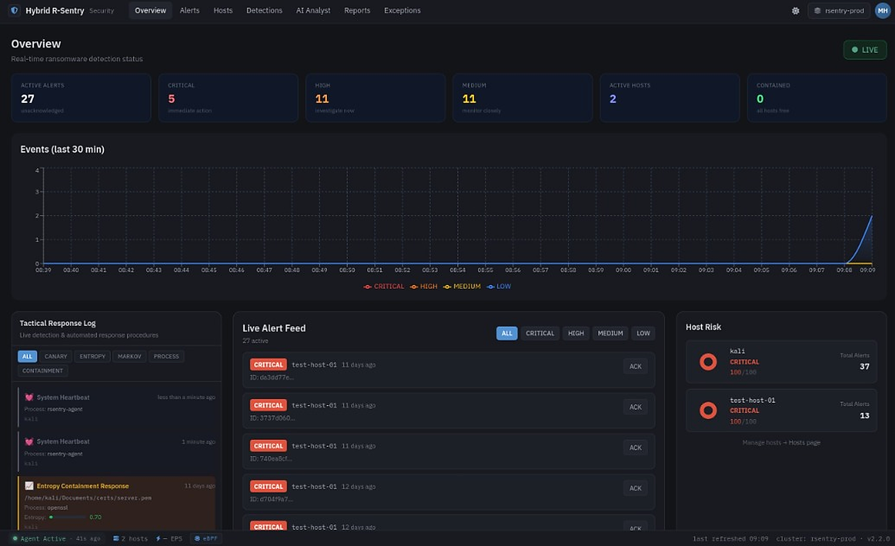
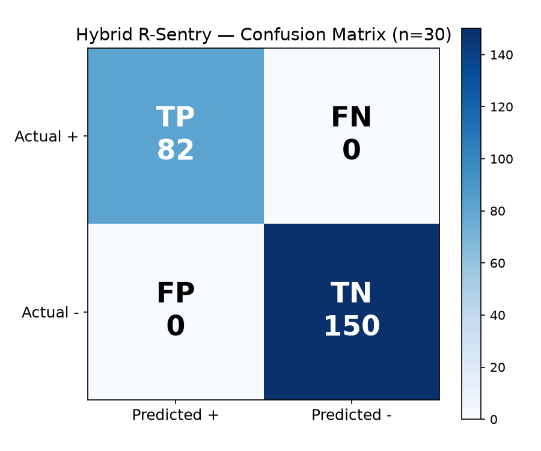

# Thesis Figures — hybrid-rsentry

All figures referenced in the thesis, organized by chapter.

---

## Chapter 6 — Implementation

### Figure 6.3.1 — Docker Compose Stack

---

### Figure 6.3.2 — FastAPI Swagger UI

---

### Figure 6.3.3 — Agent Startup

---

### Figure 6.3.4 — Environment Configuration

---

### Figure 6.3.5 — Jupyter Evaluation Notebook

---

### Figure 6.3.6 — Process Lineage Graph

---

### Figure 6.3.7 — Adaptive Canary Repositioner

---

### Figure 6.3.8 — eBPF Monitor

---

### Figure 6.3.9 — Live Dashboard

---

### Figure 6.3.10 — Watched Directory

---

## Chapter 7 — Evaluation

### Figure 7.3.1 — Dashboard Firing CRITICAL Alert (DetailFlyout Open)

---

### Figure 7.3.2 — D3 Force-Directed Filesystem Graph (EventDetailModal)

---

### Figure 7.3.3 — Agent Terminal: Detection Latency & Files-Before-Freeze

---

### Figure 7.3.4 — SIGSTOP Mid-Act → iptables DROP → SIGKILL

---

### Figure 7.3.5 — AI Threat Analyst: Family Classification & Risk Level

---

### Figure 7.3.6 — sim_random.py: EVP Entropy Layer Catches Random-Order Attack

---

### Figure 7.3.7 — sim_depth.py: Markov Canary Repositioned into Depth-3 Hot-Spot

---

### Figure 7.3.8 — Confusion Matrix (N=270; TP=120, TN=150, FP=FN=0)

---

### Figure 7.3.9 — Per-Family Detection Rate (All 4 Families: 30/30)

---

### Figure 7.3.10 — False Positive Rate by Benign Class (0% FPR)

---

### Figure 7.3.11 — Latency & Overhead Distribution

---

### Figure 7.3.12 — Robustness Results (Layer Necessity)

---

### Figure 7.3.13 — PDF Forensic Export (SHA-256 Footer Visible)

